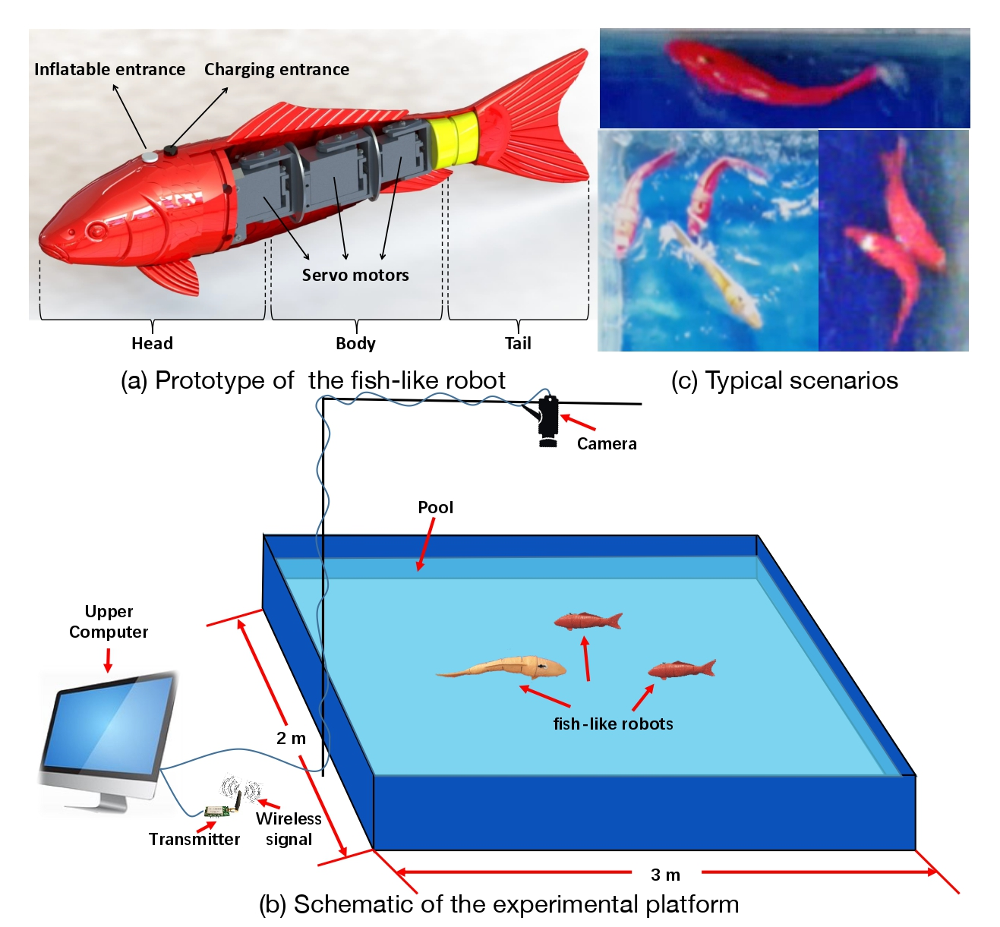
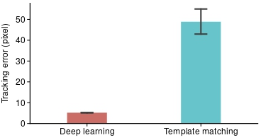
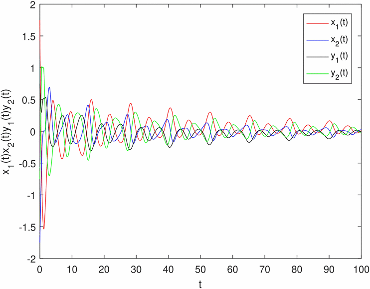
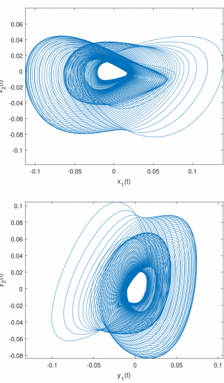
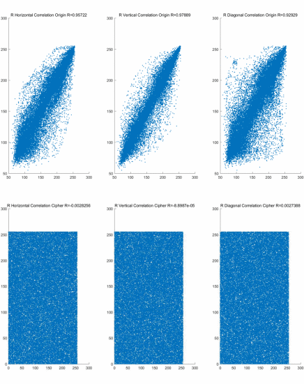
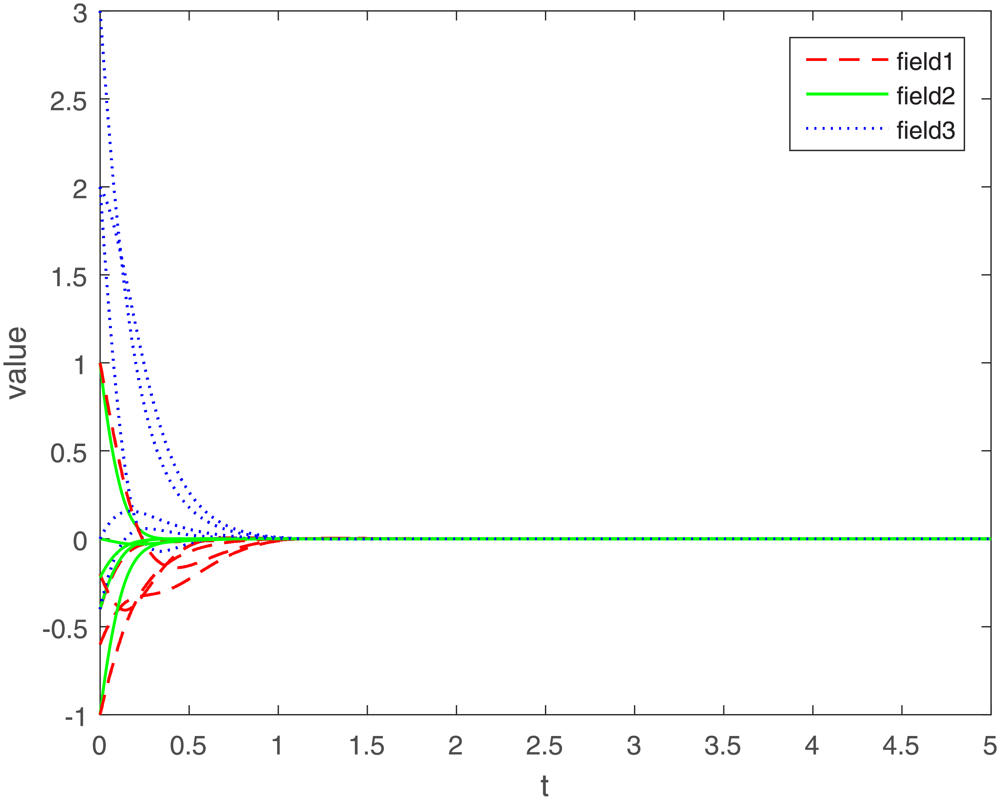
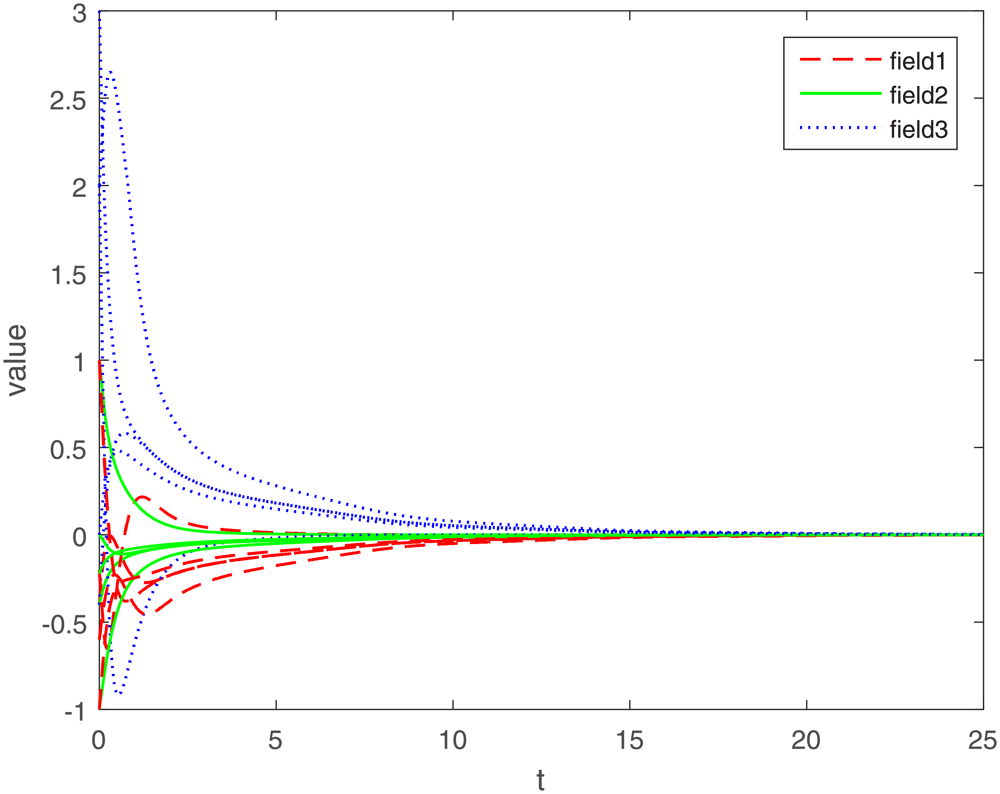
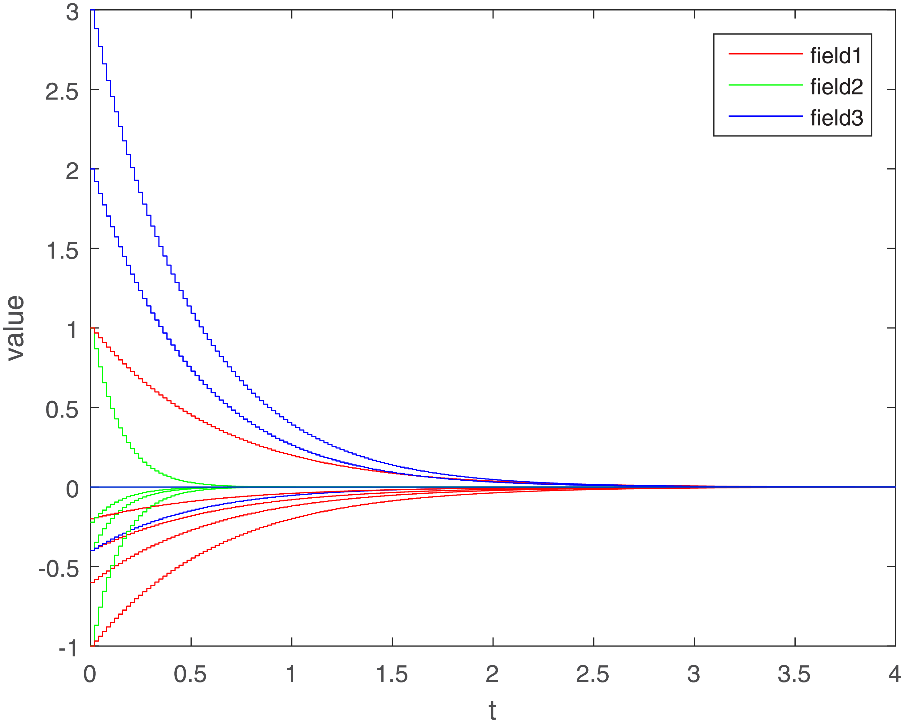

# About		

I am a Master student of Computer Science at Courant Institute of Mathematical Sciences, New York University. Prior to this, I got Bachelor of Engineering at Deparment of Automation, University of Science and Technology Beijing, in 2019.

# Research Interests

My research interests are on **Computer Vision**, **Pose Estimation**, **Reinforcement Learning on Robot Control**. Currently I am exploring on keypoint-based RL on Robot Control. Besides, I am inspired by my past research to use NNs to establish associative relationships between multiple objects.

# Education

* M.S of Computer Science, New York University, Jan. 2020 -     

* B.Eng in Intelligence Science and Technology, University of Science and Technology Beijing (USTB), Sept. 2015 - July 2019  
    GPA: 87.2/100.0, Major GPA: 89.9/100.0 and Excellent Award of Undergraduate Thesis.

# Publications

1. **TAB-IOL: Real-Time Pose Estimation and Tracking for Multiple Fish-Like Robots**  
    *Submitted, 2019*  
    Tianhao Zhang*, **Jiuhong Xiao\*,** Liang Li, Chen Wang, Wei Wang, Guangming Xie  
    
2. **Real-time Pose Estimation and Tracking of Multiple Fish-like Robots: A Marker-less Method using Deep Neural Networks**  
    *Submitted, 2019*  
    Tianhao Zhang*, **Jiuhong Xiao\*,** Liang Li, Chen Wang, Wei Wang, Guangming Xie  
       
     
3. **Image Encryption Algorithm Based on Memristive BAM Neural Networks**  
    *IEEE Third International Conference on Data Science in Cyberspace (DSC), 2018*  
    **Jiuhong Xiao**, Weiping Wang, Meiqi Wang  
      
    
4. **The stability of memristive multidirectional associative memory neural networks with time-varying delays in the leakage terms via sampled-data control**  
    *PLOS ONE, 2018*  
    Weiping Wang, Xin Xiao Yu, Xiong Luo, Long Wang, Lixiang Li, Juergen Kurths, Wenbing Zhao, **Jiuhong Xiao**  
      
    
# Project

* Object Identification System Based on Speech Feedback  
    “Huawei Cup” Intelligence Design Contest, 2018
    
* CT Image Reconstruction System  
    National Mathematical Modeling Competition, 2017

# Experiences

* Intern in Product Department  
    Ablecloud Co., Ltd, June 2017 - Sept. 2018
    
* Intern of Software Engineer  
    Beijing Beike Xinxing Science and Technology Co., Ltd, Dec. 2017 - May 2018   
    
* Tutor of Arduino  
    USTB Innovation Technology Center, Sept. 2016 - Sept. 2017

# Award

* Excellent Award of Undergraduate Thesis, USTB, 2019
* People’s Scholarship, USTB, 2015-2019
* Third Prize, “Huawei Cup” Chinese College Students Intelligence Design Contest, 2018
* First Prize, Mathematical Modeling Competition, Beijing, 2017
* Excellence Award, Boer National College Students Innovation Entrepreneurship 
* Competition, Beijing, 2017
* Second Prize, Sensor Design Competition, USTB, 2016
* Third Prize, iCAN International Contest of Innovation, China, 2016